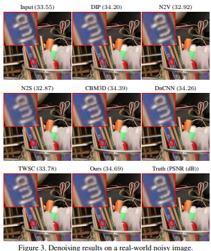
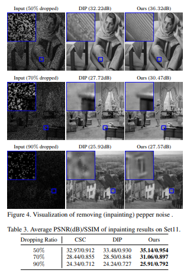

# Self to Self 论文复现

## 一、概念

​	**S2S方法是一种自监督学习的方法**。自监督学习主要是利用辅助任务（pretext）从大规模的无监督数据中挖掘自身的监督信息，通过这种构造的监督信息对网络进行训练，从而可以学习到对下游任务有价值的表征。（也就是说自监督学习的监督信息不是人工标注的，而是算法在大规模无监督数据中自动构造监督信息，来进行监督学习或训练。因此，大多数时候，我们称之为无监督预训练方法或无监督学习方法，严格上讲，他应该叫自监督学习）

## 二、S2S研究概述

### 1.使用外部数据集的噪声/干净图像对来训练去噪网络的缺陷

- 不适用于有高质量数据集需求的情况
- 收集大量有用的干净/噪音图像对是代价昂贵和困难的
- 使用一组外部数据集的噪声图像来训练去噪网络的缺陷如下：

### 2.论文使用方法

​	首先，因为只使用了单张噪声图像，所以进行图像增广来扩大数据集是必要的。因此，选择对输入图像进行**伯努利采样**得到一些实例；

​	由于输入数据集的骤减，会引起过拟合问题和方差暴增问题，因此本文使用基于**Dropout的集成方案**来解决该问题，即 dropout-based ensemble

### 3.论文结论

​	广泛的实验表明，使用本文所提出的 Self2Self 自监督学习方案训练的去噪神经网络的性能比其他基于非学习的去噪器和单图像学习的去噪器要好得多。 它甚至接近那些基于大量数据集的深度学习方法。

##  三、研究算法

### 1.模型结构

#### 编码器部分：

输入图像：H × W × C；
1、编码器首先将图像映射到具有部分卷积(PConv)层：H×W×48
2、6个编码器块处理（EBs）
3、前5个编码器快由Pconv、LRelu、MaX Pooling层组成，第6个没有MaX Pooling层。通道数固定为48
输出图像：H/32 × W/32 × 48

#### 解码器部分：

输入图像：H/32 × W/32 × 48
解码器包含五个解码器块(DBs)，其中，前4个解码器块由上采样层、级联操作、两个标准卷积层、LReLu层组成；最后1个解码器块包含三个具有LReLu的DropOut卷积层，用于将特征立方体映射回大小为H×W×C的图像
输出图像：输出图像：H × W × C

### 3.伯努利采样

伯努利采样：假设y为原图像，y^为采样结果，且图像的像素点满足伯努利分布，即非0即1（非噪声即干净），因此指定采样概率p（本文使用的概率p为0.3），对图像进行随机采样，最终会使得部分像素值置为0，其余像素值保持不变。

### 4.训练方法

由于使用伯努利采样得到一个采样矩阵Bm,使用采样矩阵进行点乘，得到采样结果Y1,再使用(1 - Bm)进行采样，得到Y2，最终最小化F(Y1) - Y2的均方误差进行训练。

### 5.降噪方案

多次使用多个采样矩阵进行采样和预测，再进行平均，得到最终的去噪图像。

## 四、论文结果介绍

### 1.盲高斯去噪

​	**s2s的方法比用无组织训练样本训练的N2V和N2S性能要好得多。**

​	 一个原因可能是无组织的训练样本没有为正在处理的噪声图像提供准确的真相信息；它可能会在神经网络中引入误导性的无关特征。

​	本文的方法在许多情况下甚至优于N2N和DnCNN，尽管它们是在带有配对样本的数据集上训练的，而本文的方法仅用单个噪声图像进行训练

### 2.真实世界噪声图像去噪

​	除了CDnCNN外，s2s方法明显优于其他基于深度学习的方法，无论是基于单个图像的方法还是基于数据集的方法。该方法取得优异结果的原因可能是训练样本的内容相当多样化。

### 3.盐尖去噪

### 4.消融实验

- dropout：训练时不使用dropout，其余参数维持不变
- ensemble：测试时不使用dropout，其余参数维持不变
- sampling：不使用伯努利采样，其余参数维持不变
- PConv：不使用部分卷积而是用全卷积，其余参数维持不变

​	由此可见，dropout、ensemble、伯努利采样、部分卷积都对最终的模型效果有着或多或少的影响。

## 五、论文复现

​	由于S2S方法消耗算力较大，单张图片在3050Ti的单张显卡上大约需要20h才能达到预期效果，暂时提供复现代码，具体复现结果还在运行中。